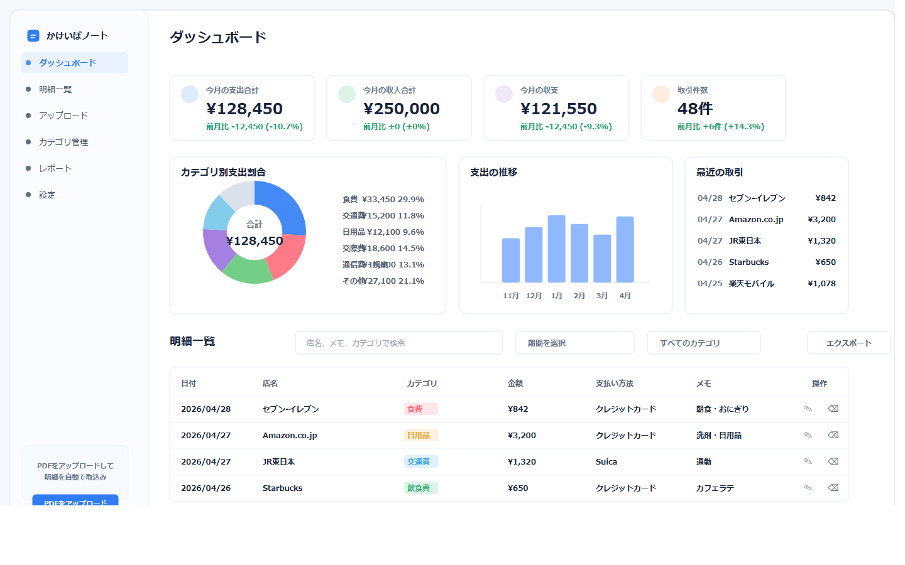
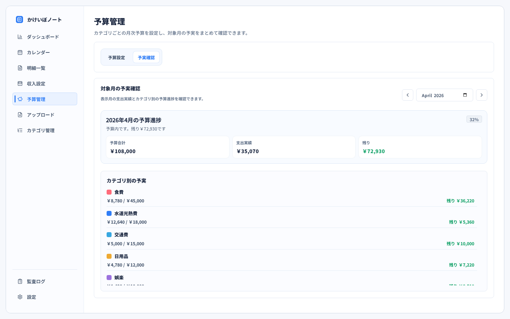
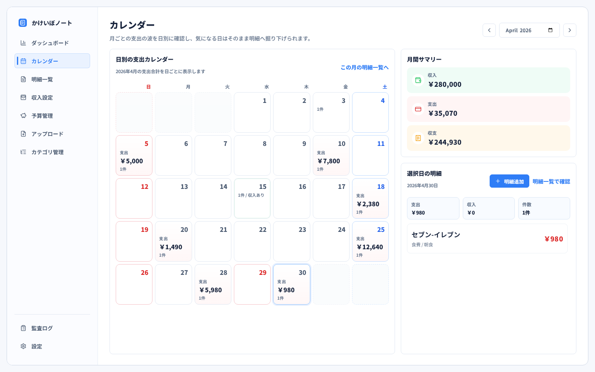
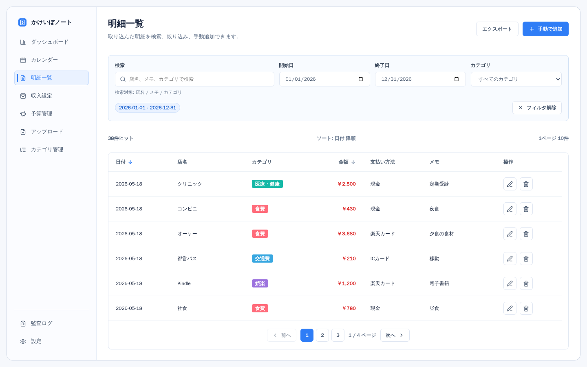
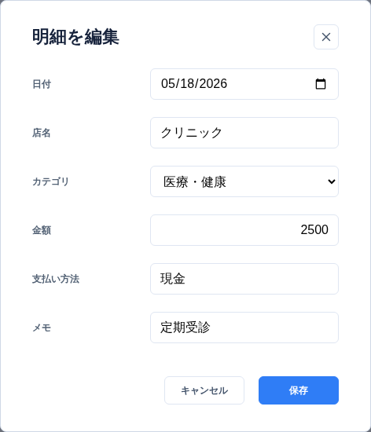
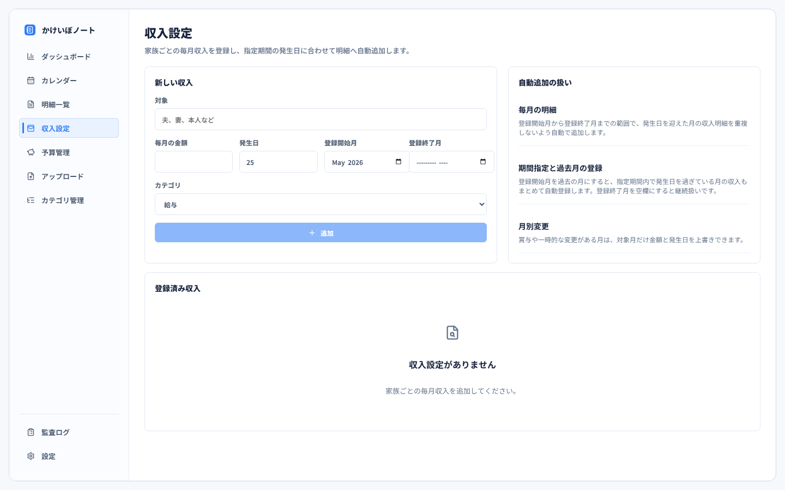
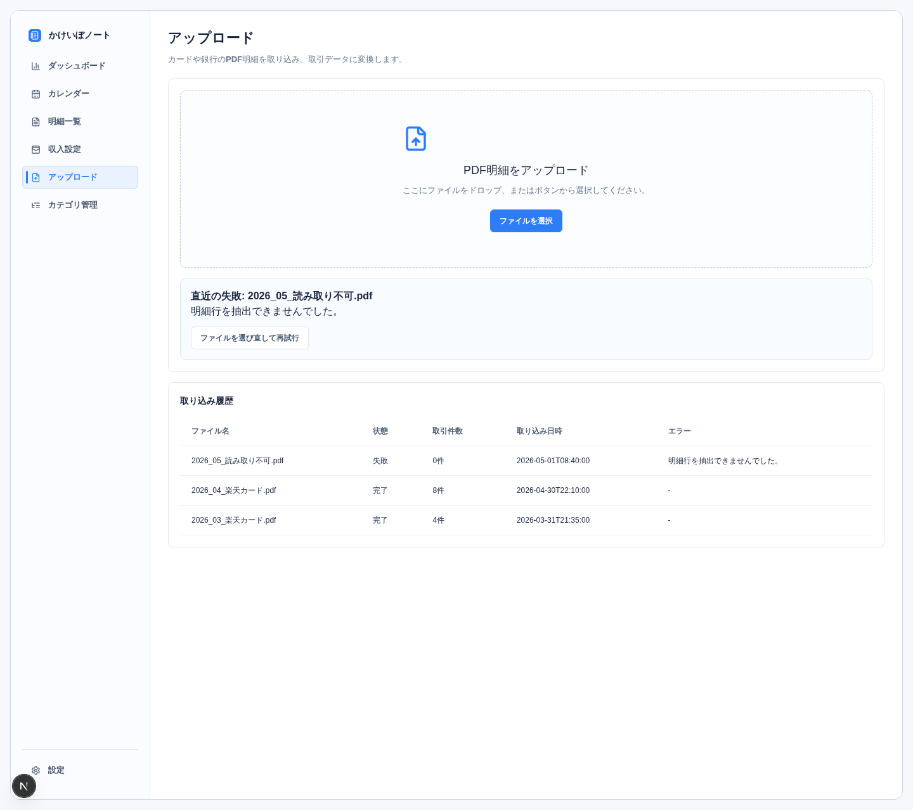
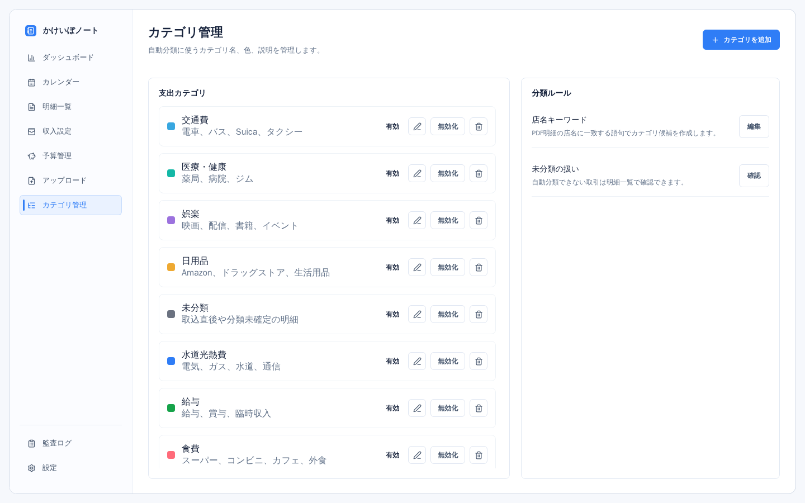
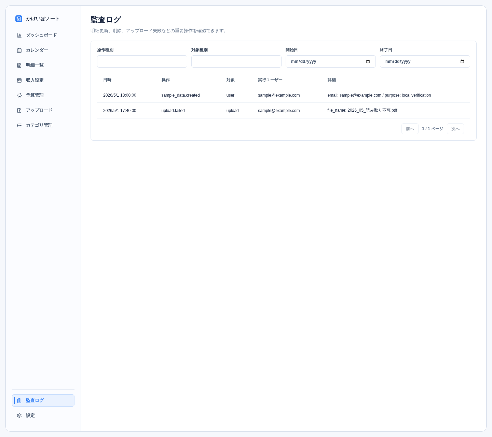
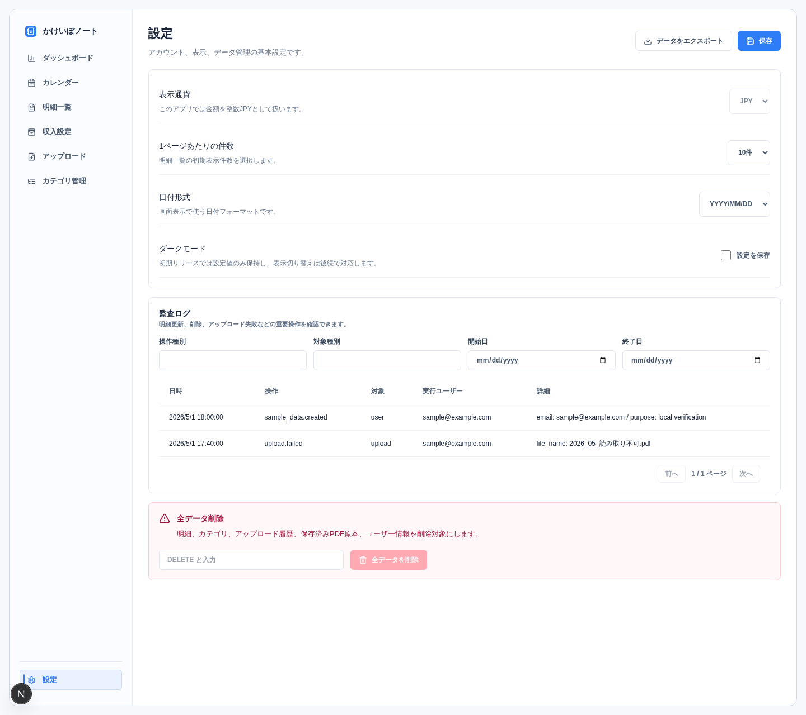

# kakeibo-app

PDF明細を取り込み、支出・収入明細、カテゴリ、レポートを管理する家計簿アプリです。

## アプリ概要

kakeibo-app は、楽天カード明細PDFから取引明細を取り込み、日々の支出・収入をカテゴリ別に管理するためのWebアプリです。明細の確認・編集、カテゴリ管理、店名キーワードによる分類ルール、月別・週別・年別の集計、Excel出力までを一つの画面群で扱います。

## 主な機能

- 楽天カード明細PDFのアップロードと明細取込
- 明細一覧、明細編集、カテゴリ管理、分類ルール
- 月別・週別・年別レポート
- Excel（`.xlsx`）エクスポート
- JWT認証
- 監査ログ

## 画面イメージ

現行画面の一覧と更新方法は [docs/designs/README.md](docs/designs/README.md) にまとめています。全画面のイメージは次のとおりです。

### ダッシュボード



### 予算管理



### カレンダー



### 明細一覧



### 明細編集モーダル



### 収入設定



### アップロード



### カテゴリ管理



### 監査ログ



### 設定



## 技術スタック

| 領域            | 採用技術                                     |
| --------------- | -------------------------------------------- |
| フロントエンド  | Next.js App Router                           |
| UI              | shadcn/ui, Tailwind CSS                      |
| 状態管理        | TanStack Query                               |
| バックエンド    | FastAPI                                      |
| アーキテクチャ  | DDD                                          |
| DB              | MySQL 8.4                                    |
| ORM / Migration | SQLAlchemy / Alembic                         |
| 認証            | JWT, HttpOnly Cookie, refresh token rotation |
| PDF抽出         | PyMuPDF                                      |
| API仕様         | FastAPI OpenAPI / Swagger UI                 |

## ローカル開発

### クイックスタート

前提ツールは Docker Desktop です。ルートのnpmエイリアスを使う場合だけ、ホスト側に Node.js 20 以上と npm が必要です。

初回は環境変数サンプルをコピーして、必要な値を調整します。

Windows PowerShell:

```powershell
Copy-Item .env.example .env
```

macOS / Linux:

```bash
cp .env.example .env
```

アプリ全体を起動します。

```powershell
docker compose up
```

初回起動時、またはDockerイメージの再作成が必要な変更を入れた場合は `--build` を付けます。

```powershell
docker compose up --build
```

停止と初期化は次のコマンドを使います。

```powershell
docker compose down
docker compose down -v
```

### 確認先

- フロントエンド: http://localhost:3000
- Swagger UI: http://localhost:8000/docs
- Health Check: http://localhost:8000/api/health

### 動作確認用ログイン

`docker compose up` ではDBマイグレーションだけを自動適用し、サンプルユーザーや画面確認用データは投入しません。全画面確認用のサンプルデータが必要な場合は、明示的にseedコマンドを実行します。

```powershell
npm run seed:sample
```

| 項目 | 値 |
| --- | --- |
| メールアドレス | `sample@example.com` |
| パスワード | `SamplePassw0rd!` |

### Git hooks

clone 後に一度だけ Git hooks を有効化します。

Windows PowerShell:

```powershell
.\scripts\install-git-hooks.ps1
```

macOS / Linux:

```bash
./scripts/install-git-hooks.sh
```

Git hooks を有効化すると、`push` 前に次を自動確認します。

- `backend/`、`docker-compose.yml`、`docs/`、`README.md`、`.codex/`、`.github/` を含む変更がある場合: `docker compose run --rm --no-deps backend python scripts/generate_requirements_lock.py --check`
- `frontend/Dockerfile.e2e`、`frontend/package.json`、`frontend/package-lock.json`、`docker-compose.yml` を含む変更がある場合: `docker compose build e2e`

### npmエイリアス

ホスト側にNode.jsがある場合は、ルートのnpm scriptsをDocker Composeコマンドの短縮形として使えます。

```powershell
npm run dev
npm run seed:sample
npm run test:backend
npm run test:backend:unit
npm run test:backend:it
npm run test:frontend
npm run test:frontend:unit
npm run test:frontend:integration
npm run test:e2e
```

### Dockerfileの使い分け

フロントエンド用のDockerfileは用途ごとに分けています。

- `frontend/Dockerfile.dev`: `docker compose up` や `docker compose run --rm --no-deps frontend ...` で使う通常開発用
- `frontend/Dockerfile.e2e`: `docker compose run --rm e2e` で使う Playwright + E2E用バックエンド実行環境付き
- `frontend/Dockerfile.prod`: 本番相当の `next build` / `next start` を確認するためのビルド用

## テスト・CI・セキュリティ確認

### テスト

動作確認やテストは、ホスト側のPython/Nodeに依存しないようDocker Composeのコンテナ内で実行します。

```powershell
docker compose run --rm backend python -m pytest
docker compose run --rm --no-deps backend python -m pytest tests/unit
docker compose run --rm backend python -m pytest -m integration
docker compose run --rm backend python -m alembic upgrade head
docker compose run --rm --no-deps frontend npm run lint
docker compose run --rm --no-deps frontend npm run typecheck
docker compose run --rm --no-deps frontend npm run test:unit
docker compose run --rm --no-deps frontend npm run test:integration
docker compose run --rm --no-deps frontend npm run test:pages
docker compose run --rm --no-deps secret-scan git /repo --no-banner --redact
docker compose run --rm --no-deps frontend npm run build
docker compose run --rm e2e
```

単体テストと結合テストの置き場、実行コマンド、CIでの実行単位は [docs/specs/development-workflow/README.md](docs/specs/development-workflow/README.md) を参照してください。E2Eの実行方法、デバッグ、安定化方針、シナリオ詳細は [docs/tests/e2e/README.md](docs/tests/e2e/README.md) を参照してください。

### GitHub Actions

GitHub Actions のCIは `quality` と `test` の2系統に分けます。

- `quality`: `frontend` の `lint` / `typecheck` / `build`、バックエンドのレイヤ依存チェック、ドキュメント未確定事項チェック、シークレットスキャン、OpenAPI生成物チェック
- `test`: `backend` の Alembic 適用確認、バックエンド単体テスト、バックエンドIntegration Test、フロントエンド単体テスト、フロントエンドIntegration Test、E2E

シークレットスキャンは `gitleaks` の `git` モードを使い、追跡対象の差分と履歴を中心に確認します。CIの詳細な実行コマンドや運用方針は [docs/specs/development-workflow/README.md](docs/specs/development-workflow/README.md) を参照してください。

OpenAPI生成クライアントを更新したい場合は、次を実行します。

```powershell
docker compose run --rm backend python scripts/generate_openapi_client.py
```

バックエンド依存のlockファイルを更新したい場合は、次を実行します。

```powershell
docker compose run --rm backend python scripts/generate_requirements_lock.py
```

`frontend/Dockerfile.e2e`、`frontend/package.json`、`frontend/package-lock.json`、`docker-compose.yml` を変更した場合は、CI前に `docker compose build e2e` でE2E実行環境の build を確認します。

### OWASP ZAPスキャン

OWASP ZAPの公式Dockerイメージ `ghcr.io/zaproxy/zaproxy:stable` を使い、FastAPIが生成するOpenAPI定義に対してAPIスキャンを実行できます。`zap` サービスは `security` profile に入れているため、通常の `docker compose up` では起動しません。

事前にDBマイグレーションとサンプルデータを適用します。

```powershell
docker compose run --rm backend python -m alembic upgrade head
npm run seed:sample
```

スキャンを実行します。

```powershell
docker compose run --rm zap
```

実行スクリプトは `http://backend:8000/api/health` を待ち、`GET /api/auth/csrf` で取得したCSRFトークンを使って `sample@example.com` / `SamplePassw0rd!` でログインします。ZAPにはBearerトークンではなく、ログイン時にSet-Cookieされた `HttpOnly` 認証Cookieと `X-CSRF-Token` ヘッダーをReplacerルールで渡します。

レポートは `zap-reports/` に出力します。

- `zap-api-report.html`
- `zap-api-report.json`
- `zap-api-report.md`

注意: ZAP API ScanはOpenAPI定義に含まれるAPIへリクエストを送ります。ローカル開発環境とサンプルデータで実行してください。認証Cookieはスクリプト開始時に取得した値を固定で使うため、アクセストークンの有効期限を超える長時間スキャンでは認証済みAPIの一部が401になる可能性があります。

ローカルでレポートを確認しやすいよう、ZAPの警告だけでは終了コードを失敗にしない `-I` を付けています。検出内容は出力されたレポートで確認してください。

### 本番デプロイ前のCookie確認

本番環境では Cookie 設定の見落としを避けるため、次を確認します。

- `COOKIE_SECURE=true` で起動していること
- 認証Cookie `kakeibo_access` / `kakeibo_refresh` と CSRF セッションCookie `kakeibo_csrf_session` に `HttpOnly`、`Secure`、`SameSite=Lax`、`Path=/` が付いていること
- `GET /api/auth/csrf` でCSRFセッションCookieが発行または再利用されること
- 本番はHTTPS配信であること

フロントエンドとバックエンドを別サイトとして運用する場合、現行の `SameSite=Lax` 前提では成立しない可能性があるため、公開前にCookie方針を見直してください。詳細は [docs/specs/security/README.md](docs/specs/security/README.md) を参照してください。

## ドキュメント

このリポジトリでは、仕様書の正本を `docs/specs/` に集約しています。実装前にまず [docs/README.md](docs/README.md) と [docs/specs/project-rules/README.md](docs/specs/project-rules/README.md) を確認し、詳細が必要な場合はそこから個別文書へ進んでください。

- [ドキュメント入口](docs/README.md)
- [プロジェクトルール](docs/specs/project-rules/README.md)
- [開発・運用ワークフロー](docs/specs/development-workflow/README.md)
- [アーキテクチャ](docs/architecture/README.md)
- [アーキテクチャ全体像](docs/architecture/overview/README.md)
- [ドメインモデル](docs/specs/domain-model/README.md)
- [API仕様](docs/specs/api-specs/README.md)
- [DBスキーマ](docs/specs/db-schema/README.md)
- [バックエンド設計](docs/architecture/backend/README.md)
- [フロントエンド設計](docs/architecture/frontend/README.md)
- [PDF取込仕様](docs/specs/pdf-import/README.md)
- [セキュリティ仕様](docs/specs/security/README.md)
- [用語集](docs/specs/glossary/README.md)
- [ADR](docs/architecture/adrs/)
- [画面別要件](docs/README.md#画面別要件)
- [画面共通要件](docs/requirements/common.md)
- [画面イメージ](docs/designs/README.md)
- [タスク管理](docs/tasks/)

## 開発ルール

仕様、設計、技術選定、画面要件、データモデル、API、セキュリティ、運用方針を変更した場合は、関連するSSOT文書を同じ作業内で更新してください。更新先の入口は [docs/specs/project-rules/README.md](docs/specs/project-rules/README.md) です。

更新後は以下で未確定事項が残っていないか確認します。

```powershell
rg "確認事項|未決定事項|TODO|TBD|要確認" docs .codex AGENTS.md README.md -g "*.md" -g "*.toml"
```

`.codex/config.toml` はCodexのローカル実行設定です。仕様の正本ではないため、Codexの参照入口、プロジェクトルート判定、承認・サンドボックス方針を変更した場合だけ同期してください。Codex向けの作業ルールはリポジトリ直下の `AGENTS.md` に置きます。

## 現在の状態

現時点の未完了タスクは [docs/tasks/open.md](docs/tasks/open.md) で管理します。完了済みタスクは [docs/tasks/completed.md](docs/tasks/completed.md) に退避しています。
