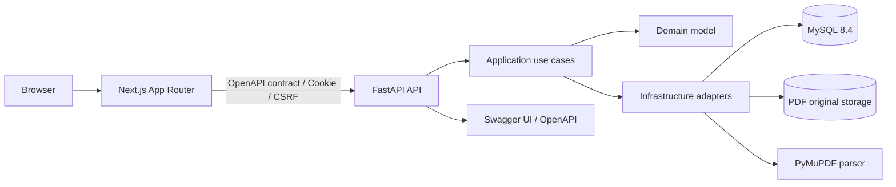

# アーキテクチャ全体像

この文書は、アプリ全体の技術スタック、システム境界、主要コンポーネントの関係をまとめる。

## 技術スタック

| 領域 | 採用技術 |
| --- | --- |
| フロントエンド | Next.js App Router |
| UI | shadcn/ui, Tailwind CSS |
| 状態管理 | TanStack Query |
| バックエンド | FastAPI |
| アーキテクチャ | ドメイン駆動設計（DDD） |
| DB | MySQL 8.4 |
| ORM / Migration | SQLAlchemy / Alembic |
| 認証 | JWT, HttpOnly Cookie, refresh token rotation |
| API契約 | FastAPI OpenAPI |
| PDF抽出 | PyMuPDF |

## 全体構成

## システム境界

- Next.js は画面表示、フォーム操作、クライアント側のUI状態管理、API呼び出しを担当する。
- FastAPI はAPI、ユースケース呼び出し、認証・認可、ファイルアップロード、PDF解析連携、永続化連携を担当する。
- フロントエンドとバックエンドの境界はAPI契約で管理する。
- API契約の機械可読な正はFastAPIが生成するOpenAPIとし、Swagger UIで確認できるようにする。
- 画面表示に必要なデータはDTOとして返し、ドメインモデルをそのまま外部公開しない。
- ドメインルールはバックエンドへ集約し、Next.js 側に業務判断を重複実装しない。
- 無効化カテゴリを未分類表示に寄せるなどの表示用業務ルールは、API DTOまたは共有ヘルパーで一元化する。

## 詳細設計

- バックエンドのレイヤ責務、依存方向、実装構成は [バックエンド設計](../backend/README.md) を参照する。
- フロントエンドの画面構成、状態管理、API連携は [フロントエンド設計](../frontend/README.md) を参照する。
- 重要な設計判断の履歴は [ADR](../adrs/README.md) を参照する。
